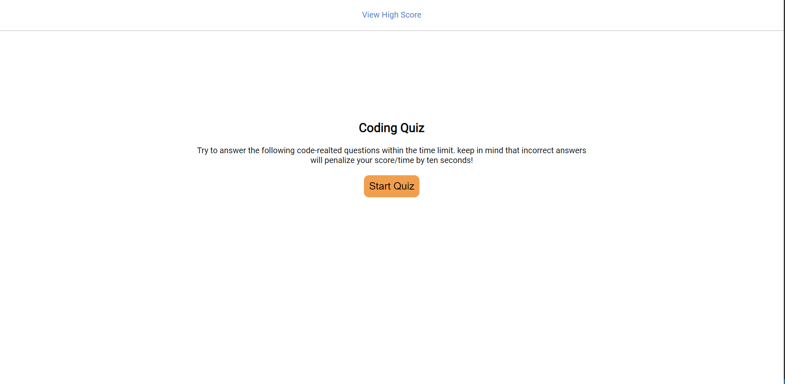
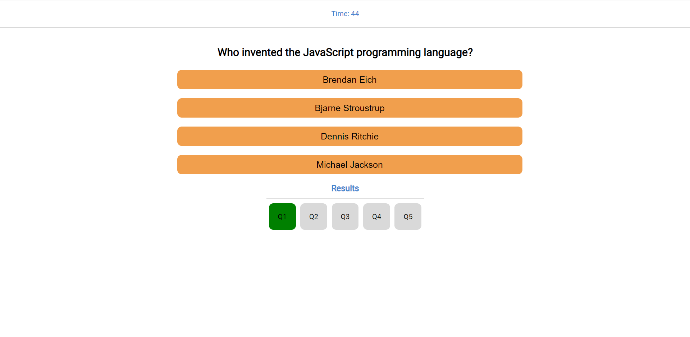
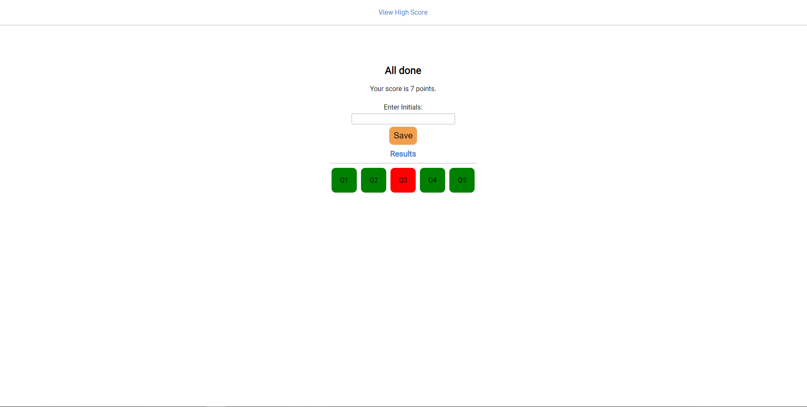
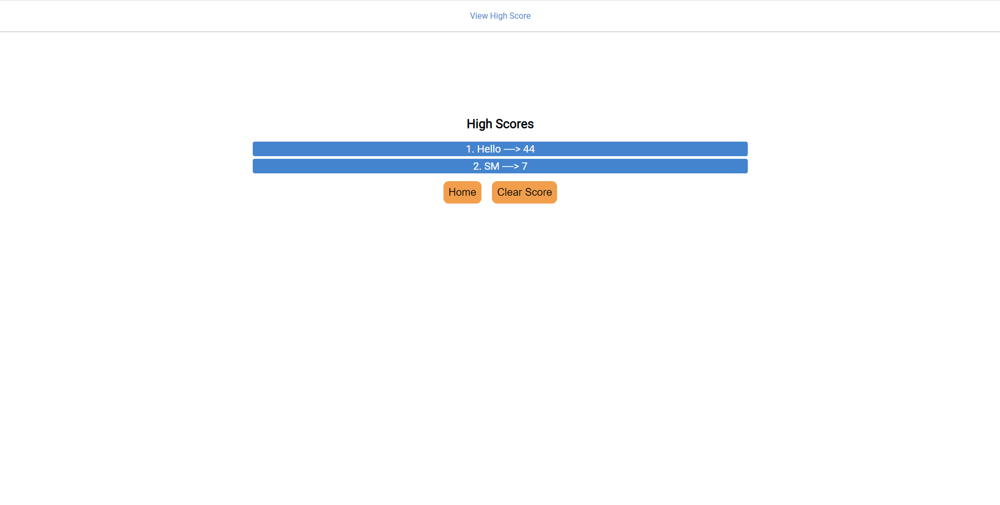
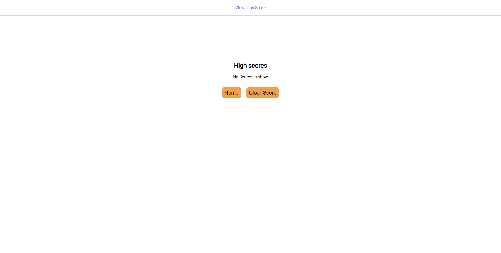

# Coding Quiz

## Description
Coding Quiz is a Single Page Application written in plain JavaScript to demonstrate my abilities of manipulating the DOM elements using JavaScript. The quiz asks the user 5 questions while under a time constraint. If the user answers a question incorrectly then there is a time penalty. Users can see if they got the previous questions right or wrong at the bottom of the page. After the quiz is complete or if the time runs out, then the user is presented with a page where they can submit there scores. All the scores are saved in the browser's local storage. After submitting the score the user is able to view a list of top 10 high scores.

## Front Page

## Quiz Page

## Score Submission Page

## High Score Page With List

## High Score Page After Clearing Score

## Deployed Link
The deployed application can be accessed by clicking [here](https://shawnmaz.github.io/coding-quiz).

---
© 2022 Shantanu Mazumder.